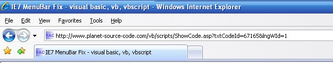



## IE7 MenuBar Fix

### Description

**UPDATE - Now asks whether you want to fix or unfix this change** For all of us that are now running the new IE7 and hate the fact the MenuBar for File, Edit etc... is sitting underneath the URL Address bar I have a small piece of code that creates a registry key to change the position of this menu.

Hope this helps...
 
### More Info
 
Type Yes or No when prompted.

None, fixes Microsofts attempt to make the toolbar look different.

             |
---                |---
**Submitted On**   |2006-11-27 11:40:02
**By**             |[Xander75](https://github.com/Planet-Source-Code/PSCIndex/blob/master/ByAuthor/xander75.md)
**Level**          |Beginner
**User Rating**    |5.0 (40 globes from 8 users)
**Compatibility**  |VB 6\.0, VB Script
**Category**       |[Internet/ HTML](https://github.com/Planet-Source-Code/PSCIndex/blob/master/ByCategory/internet-html__1-34.md)
**World**          |[Visual Basic](https://github.com/Planet-Source-Code/PSCIndex/blob/master/ByWorld/visual-basic.md)
**Archive File**   |[IE7\_MenuBa20333511272006\.zip](https://github.com/Planet-Source-Code/xander75-ie7-menubar-fix__1-67165/archive/master.zip)

